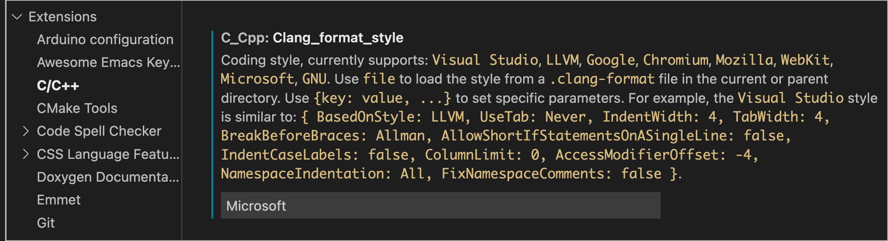

# SparkFun Code Style Guidelines

All code, examples and interfaces that are indented for a specific environment or platform (for example Arduino), will follow the guidelines for that specific platform. But for code implemented for use by SparkFun (internals of a library, a specific application, ...etc), the following coding style guidelines are used.

## Format and Layout

For all code layout and formatting, SparkFun uses the auto-formatter [clang-format](https://clang.llvm.org/docs/ClangFormat.html), with the format style set to **Microsoft**. Using clang-format with this style setting delivers code that is consistent, easy to follow and familiar. 

Additionally, clang-format is widely available as a command line command, as well as integrated in a majority of popular text editors. 

### Setting the Style in **Visual Studio Code**
In Visual Studio Code, clang-format is integrated in the standard **C/C++** extension. To change the code style, enter  **Microsoft** as the value in of `Settings > Extensions > C/C++ >` **Clang_format_style**. 

Example of this setting:



### Setting the Style in **Sublime Text**
Clang-format is available as a package via Package Control - specifically the . 

Normally the style used by the clang-format package is set using the command pallet, but the Microsoft option is fairly new and not available via this method. To set the style to **Microsoft**, the value is set in the the package settings file.  

The package settings is available from the menu `Package Settings > CLang Format > Settings - User`. In this settings file, add the `"style": "Microsoft"` line. 

```javascript
{
	"binary": "/usr/local/bin/clang-format",
	"style": "Microsoft",
}
```
Note: This example also sets the location of the clang-format binary.

## SparkFun Style Specifics 

### Class Names, Type Names
For class names and type names, upper camel case is used. Underscores or dashes are not used. Types do not end it `_t`. 

This
```C++
class MyClassName

typedef int MyTypeName
```
Not This
```C++
class My_Class_Name
class MyClassName_isAwesome

typedef int My_TypeName
typedef int MyTypeName_t
```

### Method and Variable Names
Use lower camel case for methods and variables.

This
```C++
void getName()
void startProcessingLoop()

int deviceCount;
double convergenceRange;
```

Not This
```C++
void GetName()
void get_Name()

void start_processing_loop()

int DeviceCount;
int device_count;
double CONVERGENCE_RANGE;
```

### Instance Variables
All instance variables begin with an underscore **"_"**.

This
```C++
int _currentValue;
MyLayout *_parentContainer;
```
### Variable Names - Naming Pattern
Use full words, except in the rare case where an abbreviation would be more canonical and easier to understand.

This
```C++
size_t characterSize;
size_t length;
short tabIndex; // more canonical
```

Not This
```C++
size_t charSize;
size_t len;
short tabulationIndex; // bizarre
```
Note: For simple loop counters, the use the standard convention of `i, j, k, l, m, n ...` 

### Method Names - Naming Pattern
Method names should following the pattern `[verb][Noun]`

Examples
```C++
processEvents()
validateChecksum()
setOperatingMode()
```

### Property Getter and Setter Pattern
For a getter method, the name should follow the pattern `get[Noun]`. For a setter method, the name should follow the pattern `set[Noun]`

Examples
```C++
getColor()
setColor()

getVoltage()
setVoltage()
```

### Constants
Follow the `kConstant` methodology - the letter **"k"** followed by an upper camel case name. 

This
```C++
#define kErrorMessage  (0x01 << 1)
#define kWarningMessage (0x01 << 2)
#define kInfoMessage (0x01 << 3)
```

Not This
```C++
#define ERROR_MESSAGE  (0x01 << 1)
#define WARNING_MESSAGE (0x01 << 2)
#define INFO_MESSAGE (0x01 << 3)
```
